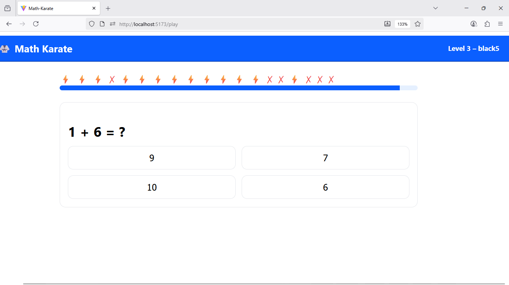
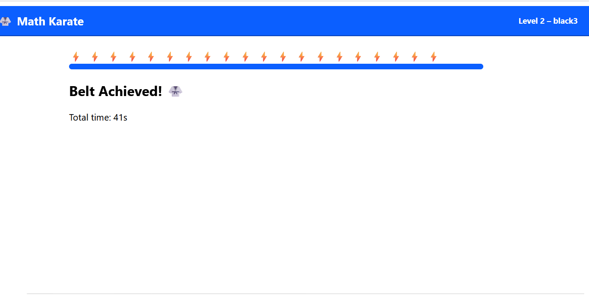

# 🥋 Math Karate

A simple React + TypeScript web app that challenges users with quick addition problems.  

---

## 🖼️ Screenshots

### Play Screen

### Home Screen

## 🚀 Getting Started

### Prerequisites
- Node.js 18+
- npm or yarn

### Install & Run

# Install dependencies
npm install

# Start dev server
npm run dev

# Open in browser
http://localhost:5173
